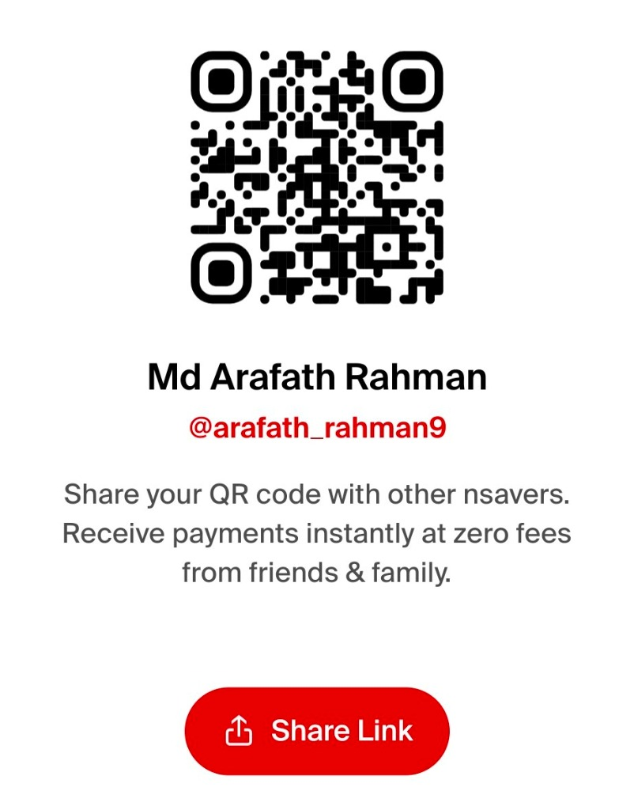

# 💫 About Me:
🔭 Building: High-end Android applications and modern web ecosystems.  🎨 Design: Minimalist UI, Material 3, and Glassmorphism.  🛠️ Stack: Android Studio (Native), Java, Kotlin, Google Antigravity, and cutting-edge AI.  📚 Learning: C++, Microsoft Visual Studio, Cursor, Windsurf, and Context.  ⚡ Philosophy: If it’s not smooth, it’s not finished. I’m obsessed with eliminating lag and perfecting motion.

## 🌐 Socials:
   

# 💻 Tech Stack:
               
# 📊 GitHub Stats:
 
 

---

<!-- Proudly created with GPRM ( https://gprm.itsvg.in ) -->

---

## ☕ Support / Buy Me a Coffee & Become a Sponsor

If you find **my open-source work & projects** helpful and want to support ongoing development, maintenance, and new features, consider contributing through any of the options below! Your support means the world and helps keep this project open-source.

<table>
  <tr>
    <td align="center" width="25%" valign="top">
      <h4>☕ SupportKori</h4>
        
       
      Cards / bKash / Nagad / Global
    </td>
    <td align="center" width="25%" valign="top">
      <h4>⚡ nsave</h4>
        
       
      Ntag: <code>@arafath_rahman9</code>
    </td>
    <td align="center" width="25%" valign="top">
      <h4>🔴 RedotPay</h4>
        
       
      ID: <code>1965421414</code>
    </td>
    <td align="center" width="25%" valign="top">
      <h4>🅿️ Payoneer</h4>
        
       
      Email: <code>arafathrahman710@gmail.com</code>
    </td>
  </tr>
</table>

 

| Method | Details / Direct Link |
| :--- | :--- |
| **☕ SupportKori** | [https://www.supportkori.com/arafathrahman](https://www.supportkori.com/arafathrahman) |
| **⚡ nsave** | Ntag: `@arafath_rahman9` • `Md Arafath Rahman` |
| **🔴 RedotPay** | Account ID: `1965421414` |
| **🅿️ Payoneer** | Email: `arafathrahman710@gmail.com` • Customer ID: `70366820` |

